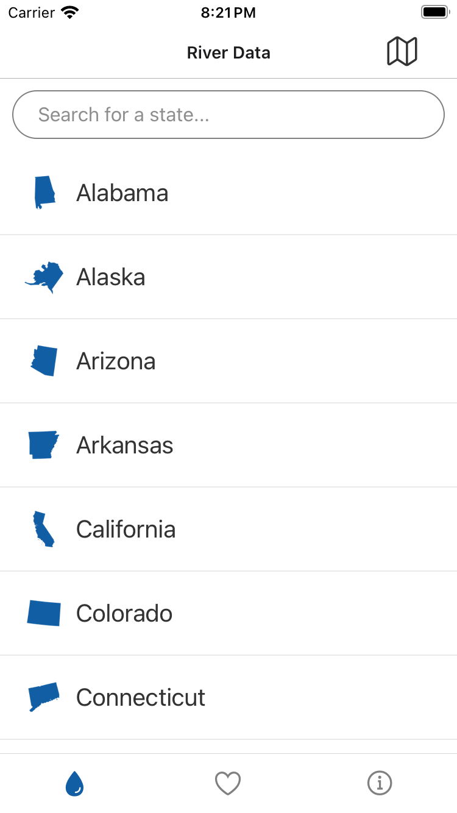

[](https://opensource.org/licenses/MIT) 
[](https://reactnative.dev/)
[](https://docs.expo.dev/)
[](https://docs.expo.dev/build/introduction/)

# riverdata-react-native
River Data application written in React Nativepod 

# General Pre-requisites

* Node JS and NPM ([intallation instructions](https://docs.npmjs.com/downloading-and-installing-node-js-and-npm))
* Make sure Expo is on the CLI ([install instructions](https://docs.expo.dev/get-started/installation/#expo-cli))
* An [Expo](expo.dev) account in order to access [EAS Builds for RiverData](https://expo.dev/accounts/drew-csci340)

# Mobile Pre-requisites

* [XCode version 14+](https://apps.apple.com/us/app/xcode/id497799835?mt=12/) (for running ios)

# Cloing this repository

1. `$ git clone git@github.com:alrudniy/riverdata.git`
1. `$ cd riverdata/riverdata`
1. `$ npm install`

Now you should be able to run on your given platform.

## iOS Specific steps

1. cd riverdata/riverdata/ios
1. pod install

If you are running XCode 15, please do the following:

1. Navigate to `riverdata/riverdata/ios/Pods/` and open `Pods.xcodeproj`.
1. Follow the instructions [in this issue comment](https://github.com/facebook/react-native/issues/37748) from June 7 and add the preprocessor macro: `_LIBCPP_ENABLE_CXX17_REMOVED_UNARY_BINARY_FUNCTION`

# Running the Project from a Terminal

The first time you clone the project you will need to run:

- `npm install` in the `riverdata` directory.

To run your project, navigate to the directory and run one of the following npm commands.

- `$ cd riverdata`

Then choose one of the platforms to run.

- `$ npm run android`
- `$ npm run ios`
- `$ npm run web`

# Using VS Code to run and debug

Visual Studio Code makes working with React Native much easier. Use it as your source code editor, version control management, app launcher and debugger. Use Github Copilot as well for some AI coding assistance. 

These instructions assume you have already cloned this repository.

1. Download [VS Code here](https://code.visualstudio.com/download) and install it to your computer.
1. Open VS Code and install the [React Native Tools Extenion](https://marketplace.visualstudio.com/items?itemName=msjsdiag.vscode-react-native). Also check out [Github Copilot Extension](https://marketplace.visualstudio.com/items?itemName=GitHub.copilot) for fun. 
1. Choose **File** > **Open Folder** and open the to the root of the Github respository.
1. Open the **Run & Debug** (Shift+Cmd+D) view in the left-side pane.
1. Choose either `npm run ios` or `npm run web` to launch the application.

**TODO** - Symbols are currently not enabled properly for debugging. Additionally the USGSMap is not working on web, but removing it's two references in App.js will allow the app to run.

The iOS simulator looks like so:




# Building Artifacts

Each target (web, android, ios) will product its own build artifacts. Here's how to do a local build for each. Each of the terminal instructions assume you are at the root of your repository. The mobile build are based on [Expo Developmebnt Builds](https://docs.expo.dev/develop/development-builds/introduction/). 

**NOTE** - Builds are a work in progress. The instructions below are an option to consider for how to build riverdata artifact for each target platform (ios, android, web). 

## web build

1. `$ cd riverdata`
2. `$ % expo build:web `

### web build local test

If you don't have `serve` installed, run `$  npm install -g serve`

1. `cd riverdata/web-build`
1. `serve -s .`

Optionally, you can run `$ python3 -m http.server` to run a python web server.

## Android build

In order to run EAS (Expo Application Services) build, you will need to create an account on [Expo here](https://expo.dev/). See also the [EAS Build Documentation](https://docs.expo.dev/build/introduction/).

1. `$ npm install -g eas-cli`
1. `$ eas build -p android`

If done successfully, an [Andriod App Bundle (.aab)](https://developer.android.com/guide/app-bundle/faq) file will be generated by the Expo build. This is all done on Expo servers so we'll need a team account, but for now you can do this individually.
 
Alternatively, in order to build an APK for local testing, you can build with:

1. `$ eas build -p android --profile apk_preview`  

See also, Build APK for [Android Emulators and devices](https://docs.expo.dev/build-reference/apk/) on Expo.

This will generate an APK you can install to your android device or emulator.

## iOS build

**NOTE:** This requires an Apple Developer account in order to build an iOS artifact wtih Expo.

1. `$ npm install -g eas-cli`
1. `$ eas build -p ios`

# Troubleshooting

## ERR_OSSL_EVP_UNSUPPORTED when running web

```
opensslErrorStack: [ 'error:03000086:digital envelope routines::initialization error' ],
  library: 'digital envelope routines',
  reason: 'unsupported',
  code: 'ERR_OSSL_EVP_UNSUPPORTED'
  ```

  If you see this error on `npm run web`, run this command:

  * Unix

  `export NODE_OPTIONS=--openssl-legacy-provider`

  * Windows

  `set NODE_OPTIONS=--openssl-legacy-provider`