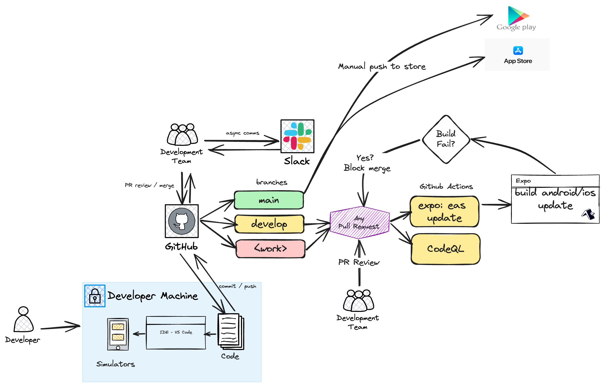
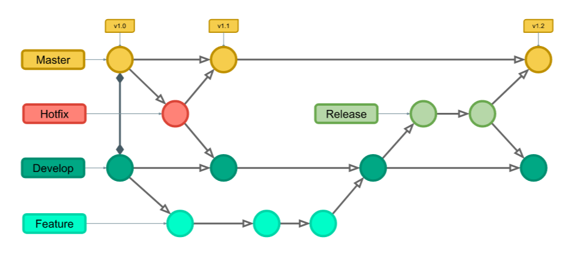

# River Data Development Environment

The image below show the general development environment for individual and collaborative development of the river data project. This is meant to be a high level over view of the tools and flows the team should be aware of for effective collaboration.

NOTE: The above image was created with [Excalidraw](https://excalidraw.com/). You can use Excalidraw for free and download your images and designs for later use. The sketch above was downloaded in Excalidraw format in [river_data_dev_environment.excalidraw](./river_data_dev_environment.excalidraw)

## Branches

The top level [README](../../README.md) has the steps for settting up the development environment. Assuming this is true and you are developing a feature you need to understand the branch philosophy:

* **main** - The main branch is for product builds that are ready to be shipped to the Google Play and App Store. Think of this as the product build you want to put in your external testers or customers' hands.

* **develop** This is the branch where all new development gets merged into. For example, if we're working on a new version with some features, we will use the develop branch to track our new changes before they are ready to be released to the `main` branch.

* **<work> branch** - This is the branch where you, the developer, works to create new features. You will typically create a branch from `develop` first, and then begin to make your code changes and commit then push them to your <work> branch. You can all this branch whatever you like. For example: `ticket1_add_favorites_view`. You typically want to keep these kinds of changes small and easily testable and reviewable.

## Reviewing pull requests

Team members should be available to review pull reqeusts from other team members. Before allowing many pull request to be merged from `<work>` to `develop`, the build must succeed and at least one team member need to approave the pull request. Either the developer or the reviewing can merge the pull request.

## Gitflow

It's important to have a visual model as well as to how the above development, branching and pull request mechanics work. We're not inventing the wheel here, the vast majority of development teams in any size organziation, are using Gitflow.

Here you can see that time goes from left to right, and each circle represents a pull request with one or more commits. Developers are working on the **Feature** row and _merging_ their feature changes to the `develop` branch. You can then see that releases are prepared and merged to the **Master** branch. Note that github no longer uses the term Master, but rather _main_ for the production and default branch.

Reference: [How to use Gitflow](https://www.campingcoder.com/2018/04/how-to-use-git-flow/)

## Git Fundamentals

Before you can enter into a collaborative development model with git as the center of your CI/CD, please make sure you understand Git fundamentals. I have outlined what I think are the minimum concepts, in this blog post, that you need to understand to work in a collaborative manner. 